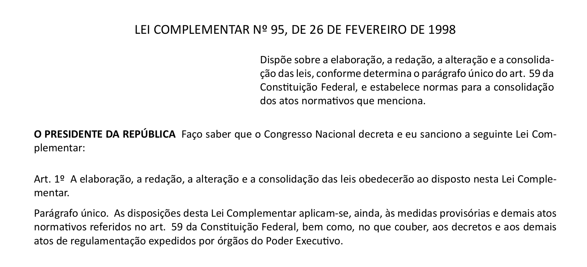

# `brlex2`

> Classe $\LaTeX$ para redação de textos jurídicos conforme legislação brasileira.



**Código:**
```latex
\documentclass[calibri]{brlex2}

\begin{document}

\epigrafe{LEI COMPLEMENTAR Nº 95, DE 26 DE FEVEREIRO DE 1998}
\ementa{Dispõe sobre a elaboração, a redação, a alteração e a consolidação das leis, conforme determina o parágrafo único do art. 59 da Constituição Federal, e estabelece normas para a consolidação dos atos normativos que menciona.}
\preambulo[O PRESIDENTE DA REPÚBLICA]{Faço saber que  o Congresso Nacional decreta e eu sanciono a seguinte Lei Complementar:}
\metadata

\art A elaboração, a redação, a alteração e a consolidação das leis obedecerão ao disposto nesta Lei Complementar.

\parun As disposições desta Lei Complementar aplicam-se, ainda, às medidas provisórias e demais atos normativos referidos no art. 59 da Constituição Federal, bem como, no que couber, aos decretos e aos demais atos de regulamentação expedidos por órgãos do Poder Executivo.

\end{document}
```

## Recursos

Esta classe é capaz de formatar atos normativos (leis, decretos, etc) e também outros textos legais com a mesma divisão padrão (estatutos, resoluções, portarias, etc). 

As regras de formatação seguem as referências (1) e (3).

No geral, é possível:

- Numeração automática de todos os dispositivos e divisões;
- Indicar a epígrafe, ementa e preâmbulo;
- Dividir o texto em partes, livros, títulos, capítulos, seções e subseções;
- Dividir os dispositivos em artigos, parágrafos, incisos, alíneas e itens;
- Indicar o uso da fonte Calibri, cf. Decreto nº 9191/2017, (apenas XeLaTeX/LuaLaTeX e com a fonte instalada);
- Formatar o numerador do dispositivo em negrito (**Art. 1º** Texto normal);
- Usar partes específicas, gerais ou enumeradas em romanos (PARTE I) ou em ordinal por extenso (PARTE PRIMEIRA);
- Metadados do PDF;
- Índice nos bookmarks do PDF, permitindo fácil navegação pelo texto.


## Instalação

Por enquanto, você deve colocar o arquivo `brlex2.cls` no mesmo diretório do seu arquivo `.tex`.

## Uso
A utilização tem o foco em ser extremamente simplificada. 

Veja o [Exemplo 1]() para um exemplo completo.


### Opções do pacote
No exemplo anterior, usamos a opção `calibri` para o pacote (`\usepackage[opção1, opção2]{brlex2}`). As opções a seguir estão disponíveis.

- `calibri`: usa a fonte Calibri (a fonte deve estar instalada e deve-se usar XeLaTeX ou LuaLaTeX como compilador);
- `indent`: em vez de adicionar espaçamento entre os parágrafos, usa indentação para diferenciar os diferentes níveis (parágrafos, incisos, alíneas, itens...);
- `artbold`: usa negrito para as numerações (**Art. 15.** Texto normal);
- `usetitle`: coloca a epígrafe em negrito. Útil para escrever um estatuto, por exemplo;
- `useitalic`: por padrão, `\emph` formata o texto em negrito, já que itálicos e sublinhados são vedados em textos jurídicos. Esta opção restaura o comportamento padrão de `\emph`.

### Comandos
Ao escrever o texto normativo, estão disponíveis os seguintes comandos:

**Dados gerais**
- `\epigrafe{...}` ou `\title{...}`: informa o identificador do ato ("Lei Nº 12/2023, de 12 de dezembro de 2023", por exemplo). Caso `usetitle` seja usado, será grafado em negrito.
- `\ementa{...}`: descreve sobre o que se trata o texto;
- `\preambulo{...}`
- `\preambulo[...]{...}`
- `\metadata`: deve ser usado após epígrafe e parágrafo, e os incluirá nos metadados do PDF.

**Separação do documento**
- `\parte{...}`: parte, com numeração romana;
- `\parte*{...}`: parte, com numeração ordinal por extenso;
- `\partegeral{...}`
- `\parteespecial{...}`
- `\livro{...}`
- `\titulo{...}`
- `\capitulo{...}`
- `\secao{...}`
- `\subsecao{...}`
- `\tema{...}` especificação temática do conteúdo de grupo de artigos ou de um artigo (grafada em letras minúsculas em negrito, alinhada à esquerda, sem numeração);

**Dispositivos**
- `\artigo ...`
- `\paragrafo ...`
- `\paragrafounico ...` 
- `\inciso ...`
- `\alinea ...`
- `\itens ...`


**Abreviações**
- `\art ...` em vez de `\artigo ...`
- `\so ...` ou `\parag ...` em vez de `\paragrafo ...`
- `\parun ...` em vez de `\paragrafounico ...` 
- `\inc ...` em vez de `\inciso ...`
- `\itm ...` em vez de `\itens ...`


## Referências normativas:

1. [Lei Complementar nº 95](https://www.planalto.gov.br/ccivil_03/leis/lcp/lcp95.htm), de 26 de fevereiro de 1998.
2. [Decreto nº 9191/2017](https://www.planalto.gov.br/ccivil_03/_ato2015-2018/2017/decreto/d9191.htm), de 1º de novembro de 2017 **(REVOGADO)**;
3. [Manual de Compilação da Legislação Brasileira](https://bd.camara.leg.br/bitstreams/0ebe1f41-2826-428c-b4d5-d2f9b1c5b97a/download) (Câmara dos Deputados, 2012);


## Autor
Desenvolvido e mantido por [Heliton Martins](https://github.com/hellmrf) (<helitonmrf@gmail.com>).

Esta classe foi largamente inspirada por [`br-lex`](https://ctan.org/pkg/br-lex), mas o código foi majoritariamente reescrito.

